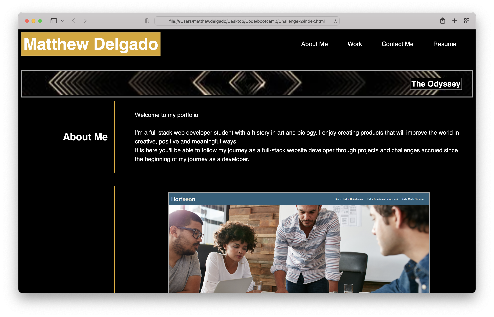

# <Your-Project-Title>

## Description

I created this professional portfolio as a way to showcase the skills i've gained working with HTML and CSS and to showcase other projects that I've completed in one place. I intend on adding to it with time and using this project as a template to build more dynamic portfolios in the course of my web development career.

## Links

[Github Repository](https://github.com/DelgaMatt/Challenge-2)

[Deployed Webpage](https://delgamatt.github.io/Challenge-2/)

## Installation

Upload index.html, lisense.txt, and assets folder to the deployed webserver. The assets folder contains images and a CSS file.

## Usage

The website can be viewed in a traditional web browser and is optimized for smaller screens. 

## License

## Badges

